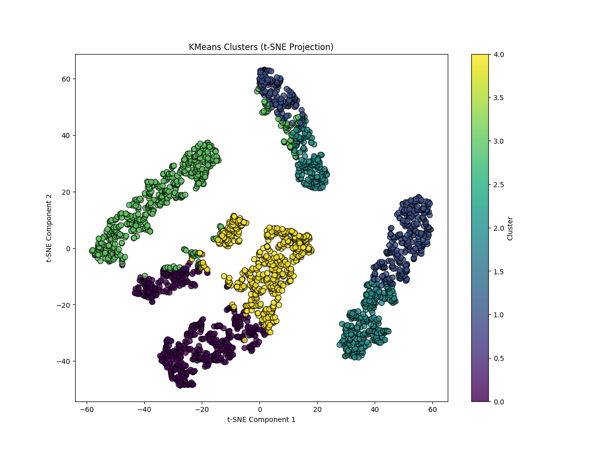

# Social Media Classification using Semi-Supervised Learning

## Overview

This project classifies unlabeled social media data using K-Means clustering and Logistic Regression.

## Features

- Data preprocessing
- StandardScaler
- K-Means clustering
- Logistic Regression
- Accuracy evaluation

## Technologies

- Python
- Pandas
- NumPy
- Scikit-learn
- Matplotlib

## Installation

```bash
pip install -r requirements.txt
python main.py
```

## Output



## Future Improvements

- Add deep learning models
- Build a web interface
- Deploy the application